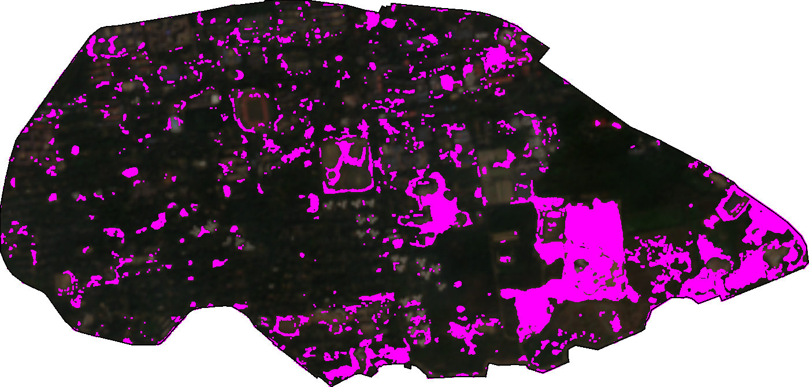
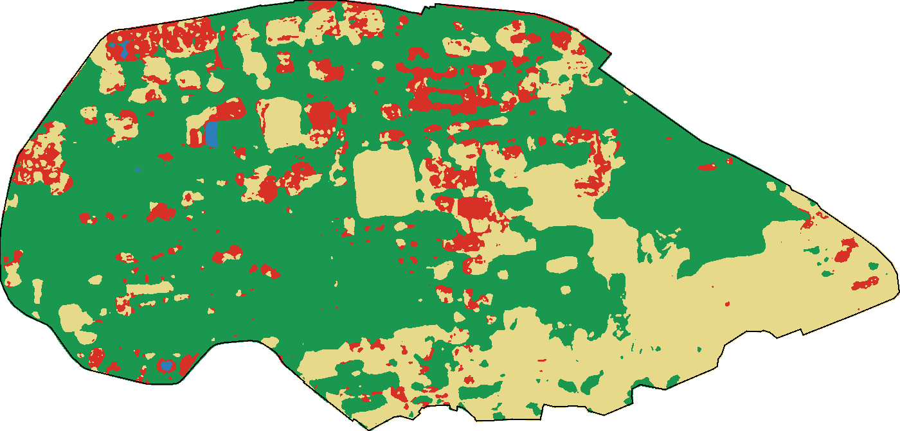
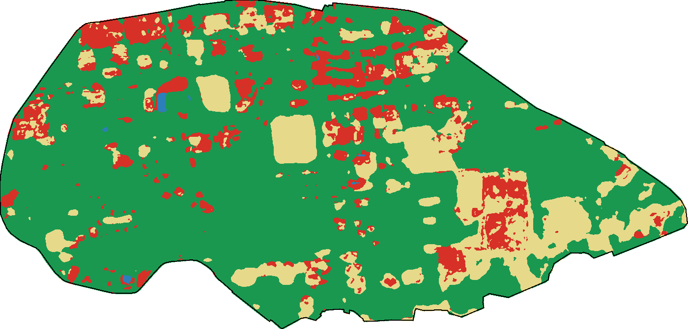

# LULC Mapping and Change Detection, IIT Kharagpur Campus (2020 vs 2025)

CS60111 Geographical Information System, Autumn 2026-27. Term project 3, Group 8.

Two-date land use / land cover map of the IIT Kharagpur campus from Sentinel-2,
and the change between them. Everything runs in Google Earth Engine from one script.



Magenta: pixels whose class changed between 2020 and 2025 and that belong to a changed patch at least 30 m wide.
The large block in the south-east is the construction compound that does not exist in the 2020 image.

## Study area

Campus boundary is OpenStreetMap way [52435606](https://www.openstreetmap.org/way/52435606)
("Indian Institute of Technology Kharagpur"), 184 vertices, 469.2 ha.
It is embedded in the script and also kept as `data/iitkgp_campus_osm.geojson`.
The OSM polygon covers the main fenced campus. Halls and quarters outside that fence are not in it.

## Data

| Item | Value |
|---|---|
| Imagery | Sentinel-2 L2A, `COPERNICUS/S2_SR_HARMONIZED`, 10 bands (B2-B8A, B11, B12), tile 45QWE |
| Epoch 1 | 1 Nov 2019 to 29 Feb 2020 (dry season), 11 scenes |
| Epoch 2 | 1 Nov 2024 to 28 Feb 2025 (same season, so phenology does not show up as change), 16 scenes |
| Scene filter | tile cloud < 40 %, then cloud inside the campus < 10 % (from the SCL band) |
| Training labels | Dynamic World V1 (`GOOGLE/DYNAMICWORLD/V1`), modal label over the same window |
| Projection for exports | UTM 45N, EPSG:32645, 10 m |

## Classes

| Code | Class | What goes in it | Dynamic World labels mapped here |
|---|---|---|---|
| 0 | Built-up | Roofs, roads, paved courts, parking | built |
| 1 | Vegetation | Tree canopy, shrubs, flooded vegetation | trees, shrub and scrub, flooded vegetation |
| 2 | Open land | Lawns, playgrounds, bare soil, cleared plots | grass, crops, bare |
| 3 | Water | Ponds, tanks, open drains wide enough to fill a 10 m pixel | water |

Dynamic World almost never says "grass" on this campus (0.6 ha in 2020). It labels the lawns and
sports fields as crops, about 50 ha in 2020. There is no farmland inside the fence, so crops go to open land.
Putting them in vegetation would hide exactly the open-to-built conversions this project is looking for.

## Method

1. Median composite per epoch after masking cloud, cloud shadow, cirrus and saturated pixels (SCL 1, 3, 8, 9, 10).
2. Add NDVI, NDBI and NDWI to the 10 reflectance bands.
3. Reference labels: every Dynamic World scene is mapped to the four classes, then the mode is taken.
   A pixel is kept only where at least 60 % of the scenes agree with the mode, which drops pixels that flicker.
4. Stratified sample per epoch: 300 built-up, 700 vegetation, 150 open land, 40 water (water has only
   about 40 pixels on campus). These counts roughly follow the class shares. With equal counts per class the
   forest put 224 ha of the campus in built-up when Dynamic World itself says about 110.
5. One Random Forest (100 trees, seed 42) trained on the 70 % training split of both epochs together and applied
   to both composites. Two separately trained forests disagree on the same unchanged pixel, and that disagreement
   shows up as fake change. A first run done that way reported 91 ha of built-up turning into vegetation.
6. 3x3 majority filter on both class maps.
7. Accuracy, two ways:
   - Holdout agreement with Dynamic World (the other 30 %). Not independent, because the labels and the test pixels come from the same product.
   - Hand-labelled points (when imported): 25+ per class per year, read off Google Earth historical
     imagery for 2020 and current imagery for 2025. These are the numbers to quote in the report.
8. Post-classification change: `code = 10 * class2020 + class2025`, so `12` is vegetation to open land.
   A changed pixel only counts if it survives a one-pixel erosion of the change mask (then dilated back),
   so changed strips narrower than about 30 m are dropped. Without this every roof gets a ring of change
   from the one-pixel boundary shift between the two composites.

## Results

All numbers come from `results/results.json`, written by `scripts/run_pipeline.py`.

| LULC 2020 | LULC 2025 |
|---|---|
|  |  |

Red built-up, green vegetation, sand open land, blue water.

### Area by class (ha)

| Class | 2020 | 2025 | Difference |
|---|---|---|---|
| Built-up | 99.7 | 100.8 | +1.1 |
| Vegetation | 335.2 | 344.1 | +8.9 |
| Open land | 32.1 | 22.2 | -9.9 |
| Water | 0.9 | 0.9 | 0.0 |

The classes add up to 467.9 ha against the 469.2 ha polygon; the rest is boundary pixels whose centre falls outside it.

### Change, 2020 to 2025 (ha)

48.6 ha changed (10.4 % of the campus); 80.3 ha before the 30 m filter.

| From | To | ha | What it is on the ground |
|---|---|---|---|
| Vegetation | Built-up | 15.8 | Mostly the south-east construction compound (11.3 ha in that quarter of the campus); median NDVI falls from 0.40 to 0.19 |
| Built-up | Vegetation | 15.0 | Pixels that really got greener (NDVI 0.31 to 0.45), but the 2020 "built-up" label there is largely canopy-over-roof and dry scrub in the east end. Read as greening, not demolition |
| Open land | Vegetation | 6.4 | Scrub regrowth in the east end, greener sports fields |
| Open land | Built-up | 6.2 | Cleared plots that got buildings |
| Vegetation | Open land | 3.1 | Clearing |
| Built-up | Open land | 2.0 | |
| Water | any | 0.1 | |

### Accuracy (Dynamic World holdout, not independent)

| | 2020 | 2025 |
|---|---|---|
| Overall accuracy | 0.842 | 0.844 |
| Kappa | 0.70 | 0.74 |
| Producer's accuracy (built / veg / open / water) | 0.65 / 0.94 / 0.70 / 1.00 | 0.76 / 0.91 / 0.68 / 1.00 |
| User's accuracy (built / veg / open / water) | 0.79 / 0.86 / 0.78 / 1.00 | 0.76 / 0.90 / 0.71 / 1.00 |

1671 training and 707 holdout pixels over both years. Water is perfect on only 11 and 13 holdout pixels, which says little.
Built-up is the weak class in 2020: 29 of 89 built-up holdout pixels came out as vegetation.
Most useful inputs (Random Forest importance): NDWI, B12, B11, B4, B8A.

## Running it

Earth Engine Code Editor:

1. Open <https://code.earthengine.google.com> (needs a registered noncommercial Cloud project).
2. Paste `gee/lulc_pipeline.js`, press **Run**. No drawing needed.
3. Console: scene tables, sample counts, confusion matrices, OA, kappa, PA, UA, areas, transitions.
4. Tasks tab: run the exports. Everything goes to `Drive/GEE_LULC/`.

Python, same pipeline, writes `results/`:

```bash
pip install -r scripts/requirements.txt
earthengine authenticate
python scripts/run_pipeline.py <your-cloud-project>
```

Optional independent validation: in the Code Editor script, add point layers named
`built20, veg20, open20, water20, built25, veg25, open25, water25` (import as FeatureCollection).
The script picks them up automatically; no `class` property is needed.

## Outputs

| File | Content |
|---|---|
| `results/results.json` | Scene lists, sample counts, confusion matrices, OA, kappa, PA, UA, importance, areas, from-to table |
| `results/*.png` | True colour composites, class maps, change map |
| `S2_composite_2020.tif`, `S2_composite_2025.tif` | 10-band reflectance composites (Drive export) |
| `LULC_2020.tif`, `LULC_2025.tif` | Class maps, values 0-3 (Drive export) |
| `LULC_transition_code.tif` | From-to code per pixel (Drive export) |
| `area_2020.csv`, `area_2025.csv`, `transitions_2020_2025.csv` | Hectares per class and per from-to pair (Drive export) |

## Known limits

- The accuracy above is agreement with Dynamic World, not with the ground. The hand-labelled points are what make it independent.
- Change accuracy is not measured. Two maps at about 84 % each can give a change map near 70 %, so transitions of a few hectares are within error.
- 10 m pixels mix roof and canopy along tree-lined roads and in the residential quarters. Most of the built-up / vegetation confusion is there.
- The 30 m filter also drops real change narrower than 30 m, for example a single new building on a lawn.
- Per-map class areas and the from-to table do not reconcile exactly, because the class areas still include the sub-30 m edge flips that the change filter drops.
- Dry-season haze is not masked by SCL. The 10 % in-campus cloud filter helps, but it is not a haze filter.

## Repository layout

```
gee/lulc_pipeline.js      the pipeline (Code Editor)
gee/original/             my first drafts of the acquisition and classification scripts, kept for history
scripts/run_pipeline.py   same pipeline through the Python API, writes results/
results/                  numbers and figures from the last run
data/                     campus boundary from OSM
TASKS.md                  who does what before the mid-term
```

## Team and contributions

| Member | Roll no. | Contribution so far |
|---|---|---|
| Ashutosh Sharma | 23CS10005 | Topic selection and group registration; Earth Engine project setup; first-draft GEE acquisition and classification scripts (`gee/original/`); revised pipeline (OSM boundary, Dynamic World training labels, pooled Random Forest, change filter, independent validation hook, area and transition exports); Python runner; both epochs run and results; repository and documentation |
| Krishnkant Sahu | 23CS10035 | |
| Sanskar Sovitkar | 24CS10131 | |
