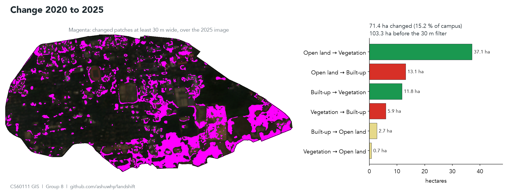
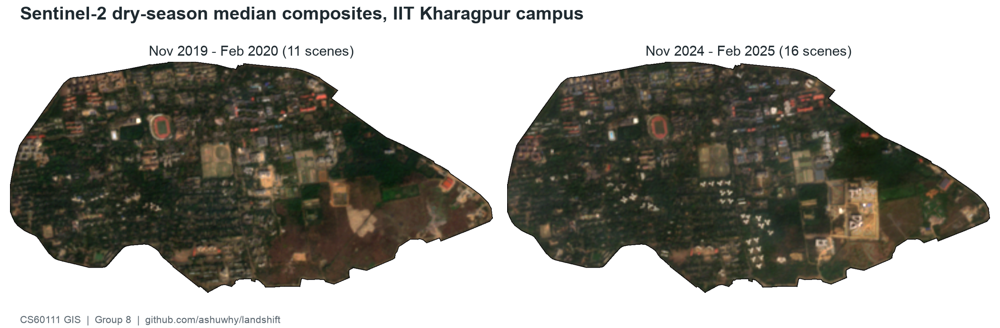
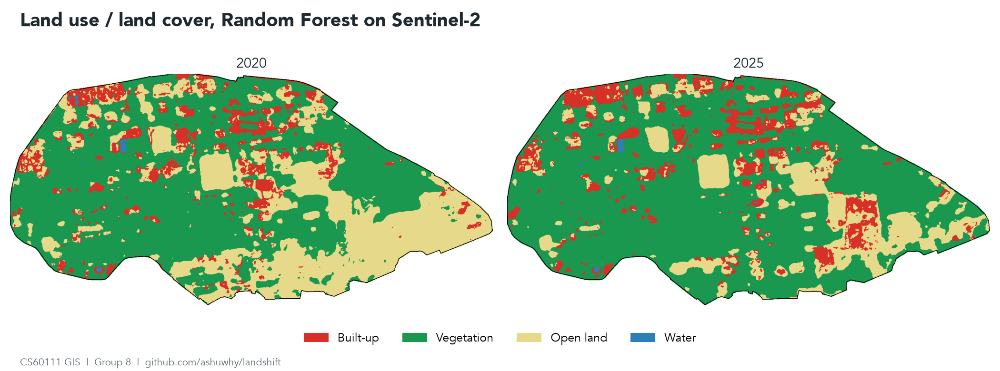
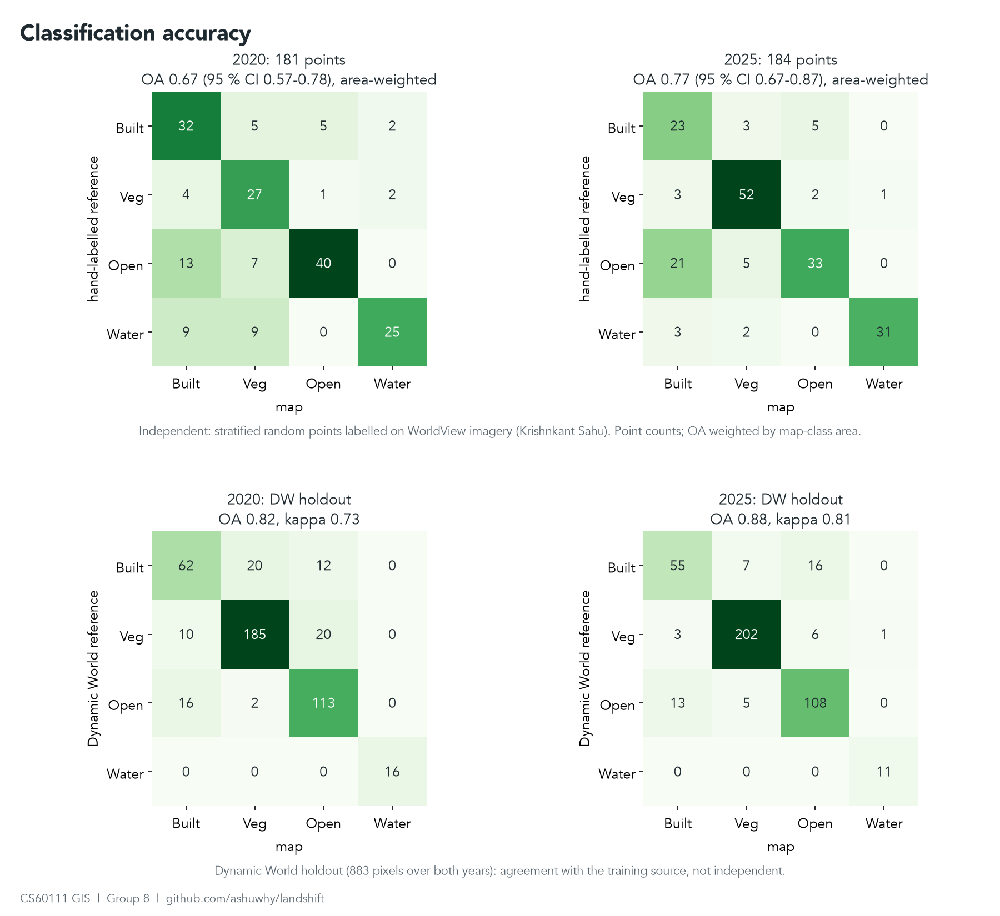
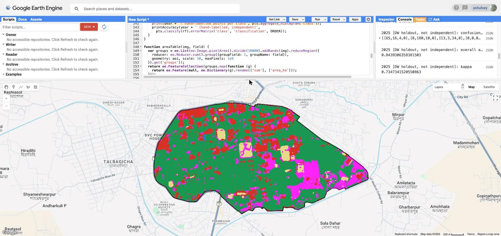

# LULC Mapping and Change Detection, IIT Kharagpur Campus (2020 vs 2025)

CS60111 Geographical Information System, Autumn 2026-27. Term project 3, Group 8.

Two-date land use / land cover map of the IIT Kharagpur campus from Sentinel-2,
and the change between them. Everything runs in Google Earth Engine from one script.



Magenta: pixels whose class changed between 2020 and 2025 and that belong to a changed patch at least 30 m wide.
The large blocks in the south-east are the construction compound that does not exist in the 2020 image and the
east-end grassland growing into scrub.

## Study area

Campus boundary is OpenStreetMap way [52435606](https://www.openstreetmap.org/way/52435606)
("Indian Institute of Technology Kharagpur"), 184 vertices, 469.2 ha.
It is embedded in the script and also kept as `data/iitkgp_campus_osm.geojson`.
The OSM polygon covers the main fenced campus. Halls and quarters outside that fence are not in it.

## Data

| Item | Value |
|---|---|
| Imagery | Sentinel-2 L2A, `COPERNICUS/S2_SR_HARMONIZED`, 10 bands (B2-B8A, B11, B12), tile 45QWE |
| Epoch 1 | 1 Nov 2019 to 29 Feb 2020 (winter), 11 scenes, plus 1 Mar to 31 May 2020 (pre-monsoon), 11 scenes |
| Epoch 2 | 1 Nov 2024 to 28 Feb 2025, 16 scenes, plus 1 Mar to 31 May 2025, 13 scenes. Same seasons, so phenology does not show up as change |
| Scene filter | tile cloud < 40 %, then cloud inside the campus < 10 % (winter) or < 20 % (pre-monsoon, hazier), from the SCL band |
| Training labels | Dynamic World V1 (`GOOGLE/DYNAMICWORLD/V1`), modal label over the same window |
| Projection for exports | UTM 45N, EPSG:32645, 10 m |



## Classes

| Code | Class | What goes in it | Dynamic World labels mapped here |
|---|---|---|---|
| 0 | Built-up | Roofs, roads, paved courts, parking | built |
| 1 | Vegetation | Tree canopy, dense scrub, flooded vegetation | trees, flooded vegetation |
| 2 | Open land | Lawns, playgrounds, dry grassland, bare soil, cleared plots | grass, crops, shrub and scrub, bare |
| 3 | Water | Ponds, tanks, open drains wide enough to fill a 10 m pixel | water |

Dynamic World almost never says "grass" on this campus (0.6 ha in 2020). It labels the lawns and
sports fields as crops, about 50 ha in 2020. There is no farmland inside the fence, so crops go to open land.
Putting them in vegetation would hide exactly the open-to-built conversions this project is looking for.
Dynamic World's "shrub and scrub" on campus is the dry grassland with scattered bushes in the east end, which the
independent points label open land, so it goes to open land too. Scrub dense enough to read as canopy is still vegetation.

## Method

1. Median composites per epoch, winter and pre-monsoon, after masking cloud, cloud shadow, cirrus and saturated pixels (SCL 1, 3, 8, 9, 10).
2. Features: the 10 winter bands with NDVI, NDBI and NDWI; 3x3 standard deviation of NDVI and B8 (canopy is rough, lawns
   are smooth); B4, B8, B11, B12 and the three indices from the pre-monsoon composite, and the NDVI drop between
   the two (grass dries out by May, trees stay green). Dynamic World labels alone cannot tell a lawn under scattered
   trees from canopy; these features can.
3. Reference labels: every Dynamic World scene is mapped to the four classes, then the mode is taken.
   A pixel is kept only where at least 60 % of the scenes agree with the mode, which drops pixels that flicker.
4. Stratified sample per epoch: 300 built-up, 700 vegetation, 450 open land, 40 water (water has only
   about 40 pixels on campus). Built-up and vegetation roughly follow the class shares: with equal counts per class
   the forest put 224 ha of the campus in built-up when Dynamic World itself says about 110. Open land is sampled
   above its share, because at its share the forest rarely predicted it.
5. One Random Forest (100 trees, seed 42) trained on the 70 % training split of both epochs together and applied
   to both composites. Two separately trained forests disagree on the same unchanged pixel, and that disagreement
   shows up as fake change. A first run done that way reported 91 ha of built-up turning into vegetation.
6. 3x3 majority filter on both class maps.
7. Accuracy, two ways:
   - Holdout agreement with Dynamic World (the other 30 %). Not independent, because the labels and the test pixels come from the same product.
   - Independent points (`gee/validation_points.js`): 181 for 2020 and 184 for 2025, at least 25 per class per year.
     A stratified random sample on the map classes, labelled on WorldView-2 imagery of 15 Mar 2020 and WorldView-3
     imagery of 13 Jan 2024 (Esri World Imagery Wayback). These are the numbers to quote in the report.
     Imagery, labelling rules and hard cases are in `validation/NOTES.md`.
   - The open-land fixes in steps 1, 2, 4 and the class table came after the first independent check (OA 0.61 / 0.74).
     Six variants were compared on the odd-numbered points only; the even-numbered half was held out
     (see "How the method was chosen").
8. Post-classification change: `code = 10 * class2020 + class2025`, so `12` is vegetation to open land.
   A changed pixel only counts if it survives a one-pixel erosion of the change mask (then dilated back),
   so changed strips narrower than about 30 m are dropped. Without this every roof gets a ring of change
   from the one-pixel boundary shift between the two composites.

## Results

All numbers come from `results/results.json`, written by `scripts/run_pipeline.py`.



### Area by class (ha)

| Class | 2020 | 2025 | Difference |
|---|---|---|---|
| Built-up | 93.4 | 88.6 | -4.8 |
| Vegetation | 270.7 | 327.5 | +56.8 |
| Open land | 103.1 | 51.1 | -52.0 |
| Water | 0.7 | 0.7 | 0.0 |

These are map areas. The independent points give area estimates that correct for the map's errors (next section);
quote those for class totals. The classes add up to 468.0 ha against the 469.2 ha polygon; the rest is boundary pixels whose centre falls outside it.

### Change, 2020 to 2025 (ha)

71.4 ha changed (15.2 % of the campus); 103.3 ha before the 30 m filter.

| From | To | ha | What it is on the ground |
|---|---|---|---|
| Open land | Vegetation | 37.1 | East-end grassland growing into scrub: 31.6 ha of it is in the south-east quarter. Median winter NDVI 0.38 to 0.50, pre-monsoon 0.46 to 0.56, while pixels that s[...] |
| Open land | Built-up | 13.1 | Mostly the south-east construction compound, scrub and tracks in 2020; NDVI 0.33 to 0.15 |
| Built-up | Vegetation | 11.8 | Pixels that really got greener (NDVI 0.34 to 0.44), but the 2020 "built-up" label there is largely canopy over roofs. Read as greening, not demolition |
| Vegetation | Built-up | 5.9 | New buildings on wooded plots; NDVI 0.46 to 0.20 |
| Built-up | Open land | 2.7 | |
| Vegetation | Open land | 0.7 | Clearing |

The independent points point the same way: estimated open land falls from 146 to 96 ha and vegetation rises from
220 to 315 ha (table below). The two samples are separate points, so that is a check on direction, not a change accuracy.

### Accuracy

Against the independent points (181 for 2020, 184 for 2025, `validation/`), on the filtered maps the areas come from.
The sample is stratified by the classes of the first map, so every estimate is weighted by the area of those strata
(Olofsson et al. 2014; Stehman 2014, since the current map no longer matches the strata; `validation/strata_ha.json`).
Raw point counts would let water, 0.2 % of the campus and a third of the points, set the score.

| | 2020 | 2025 |
|---|---|---|
| Overall accuracy (95 % CI) | 0.68 (0.57-0.78) | 0.77 (0.67-0.87) |
| User's accuracy (built / veg / open / water) | 0.53 / 0.68 / 0.84 / 0.86 | 0.46 / 0.86 / 0.69 / 0.97 |
| Producer's accuracy (built / veg / open / water) | 0.53 / 0.92 / 0.41 / 0.12 | 0.65 / 0.92 / 0.33 / 0.86 |

Estimated area from the points (95 % CI), ha:

| Class | 2020 | 2025 |
|---|---|---|
| Built-up | 99 (60-137) | 57 (33-82) |
| Vegetation | 220 (169-272) | 315 (273-356) |
| Open land | 146 (98-194) | 96 (56-135) |
| Water | 3 (0-8) | 0.4 (0-1) |



Open land is still the weak class: the map finds a third to two fifths of it. What it misses are small lawns and
courtyards between buildings, which a 10 m pixel mixes with the roofs around them, and lawns under scattered trees.
Built-up spreads onto those same courtyards (user's accuracy 0.46-0.53). In 2025, shadows on the north side of the
new tall buildings come out as water. Producer's accuracy for water rests on a few points in large strata and means little.
The built-up estimate for 2025 (57 ha) below 2020 (99 ha) is not demolition: the two point samples are independent,
the intervals overlap, and 2025 built-up has only 31 points.

Holdout agreement with Dynamic World is 0.83 / 0.88 (kappa 0.73 / 0.81, 883 holdout pixels). That is agreement with
the training source; the gap to the numbers above is why the independent check matters.
The Code Editor prints the unweighted matrices on the unfiltered classification (OA 0.72 / 0.74, kappa 0.63 / 0.65);
`scripts/run_pipeline.py` writes both to `results.json`.
Most useful inputs (Random Forest importance): pre-monsoon B12, B11, NDVI texture, B12, B8A, pre-monsoon B11 and NDWI.

### How the method was chosen

The first version (winter composite only, open land sampled at its share, shrub as vegetation) scored 0.61 / 0.74.
Dynamic World itself scores 0.58 / 0.73 against the points, so the forest was copying its labels' mistakes:
at the reference open-land points DW says trees or built about half the time. Ten variants were scored on the
odd-numbered points (`scripts/compare_variants.py`), mean OA over both years. The first six were picked from the error notes, the last four
check which parts of the chosen one matter:

| Variant | Odd points | Even points (held out) |
|---|---|---|
| First version | 0.65 | 0.70 |
| + open land sampled at 450 | 0.645 | 0.755 |
| + texture | 0.635 | 0.755 |
| + pre-monsoon composite | 0.665 | 0.715 |
| all three | 0.67 | 0.755 |
| **all three + shrub to open land (used)** | **0.685** | **0.76** |
| shrub to open land only | 0.66 | 0.74 |
| open land at 450 + shrub | 0.665 | 0.775 |
| open land at 450 + pre-monsoon + shrub | 0.68 | 0.76 |
| used, with open land at 600 | 0.675 | 0.795 |

Chosen on the odd half by a rule fixed before the runs (best mean OA there); two variants do a little better on the even half, which is the noise below. Differences under about 0.05 are within the noise; with 90 points, the honest claim is "better on both halves", not the third decimal.

## Running it

Earth Engine Code Editor:

1. Open <https://code.earthengine.google.com> (needs a registered noncommercial Cloud project).
2. Paste `gee/lulc_pipeline.js`, press **Run**. No drawing needed.
3. Console: scene tables, sample counts, confusion matrices, OA, kappa, PA, UA, areas, transitions.
4. Tasks tab: run the exports. Everything goes to `Drive/GEE_LULC/`.



Class maps with the change layer (magenta) on top, after a run.

Python, same pipeline, writes `results/`:

```bash
pip install -r scripts/requirements.txt
earthengine authenticate
python scripts/run_pipeline.py <your-cloud-project>
python scripts/make_figures.py . docs/img
```

Independent validation: paste `gee/validation_points.js` above the pipeline in the same Code Editor script.
It defines the point layers `built20, veg20, open20, water20, built25, veg25, open25, water25`; the script
picks them up and prints the independent confusion matrices. See `validation/NOTES.md`.

## Outputs

| File | Content |
|---|---|
| `results/results.json` | Scene lists, sample counts, confusion matrices, OA, kappa, PA, UA, importance, areas, from-to table |
| `results/*.png` | True colour composites, class maps, change map |
| `docs/img/` | Figures with titles and legends built from `results/` (README, slides), Code Editor screenshots |
| `S2_composite_2020.tif`, `S2_composite_2025.tif` | 10-band reflectance composites (Drive export) |
| `LULC_2020.tif`, `LULC_2025.tif` | Class maps, values 0-3 (Drive export) |
| `LULC_transition_code.tif` | From-to code per pixel (Drive export) |
| `area_2020.csv`, `area_2025.csv`, `transitions_2020_2025.csv` | Hectares per class and per from-to pair (Drive export) |

## Known limits

- Open land is still under-mapped (producer's accuracy 0.33-0.41), mostly small lawns and courtyards between buildings.
  Transitions of a few hectares are within error; the results rest on the large, NDVI-checked ones.
- Change accuracy is not measured. Two maps at 0.68 and 0.77 give a change map below either. Many small magenta patches
  in the north are lawn / canopy edges flipping class, not change.
- The method was tuned on half of the validation points, so the accuracies above are slightly optimistic;
  the held-out half (0.70 / 0.82) is the fairer check.
- 10 m pixels mix roof and canopy along tree-lined roads and in the residential quarters. Most of the built-up / vegetation confusion is there.
- The 30 m filter also drops real change narrower than 30 m, for example a single new building on a lawn.
- Per-map class areas and the from-to table do not reconcile exactly, because the class areas still include the sub-30 m edge flips that the change filter drops.
- Dry-season haze is not masked by SCL. The 10 % in-campus cloud filter helps, but it is not a haze filter.

## Repository layout

```
gee/lulc_pipeline.js      the pipeline (Code Editor)
gee/original/             my first drafts of the acquisition and classification scripts, kept for history
gee/validation_points.js  independent validation points as the Code Editor layers built20 ... water25
scripts/run_pipeline.py   same pipeline through the Python API, writes results/
scripts/make_figures.py   titled figures from results/ into docs/img/
scripts/compare_variants.py  the method variants scored on the validation halves
scripts/sample_validation_points.py  draws the validation sample from results/
scripts/export_validation.py         validation/points.csv -> gee/validation_points.js and the location figure
validation/strata_ha.json the stratum areas the validation sample was drawn from
validation/               the validation points with labels and notes (points.csv), labelling notes (NOTES.md)
results/                  numbers and figures from the last run
docs/img/                 figures and screenshots used in this README
data/                     campus boundary from OSM
TASKS.md                  who does what before the mid-term
```

## Team and contributions

| Member | Roll no. | Contribution so far |
|---|---|---|
| Ashutosh Sharma | 23CS10005 | Earth Engine pipeline, from my first drafts (`gee/original/`) to `gee/lulc_pipeline.js`: cloud-masked Sentinel-2 composites, Dynamic World training labels, Random Forest, post-classification change. Diagnosed the first run (224 ha built-up, 139 ha of change) and fixed it: proportional sampling, one forest for both years, crops to open land, 30 m change filter. Python runner that reproduces every Console number. Both epochs run: class maps, areas, from-to table, accuracy. Change checked against NDVI. Area-weighted independent accuracy and area estimates from the validation points (Olofsson / Stehman estimators). Found that the map copied Dynamic World's open-land errors and fixed it (pre-monsoon composite, texture, label and sampling changes), chosen on half the points and checked on the other half: OA 0.61 / 0.74 to 0.68 / 0.77. Figures, this README, the mid-term deck |
| Krishnkant Sahu | 23CS10035 | Independent validation set: 365 points (181 for 2020, 184 for 2025, at least 25 per class per year), a stratified random sample on the map classes labelled on dated high-resolution imagery (WorldView-2, 15 Mar 2020; WorldView-3, 13 Jan 2024) after correcting its offset to Sentinel-2 (`gee/validation_points.js`, `validation/points.csv`). Labelling notes: imagery dates, rules, hard cases (south-east compound, shadows of the new buildings, algae-covered ponds, dark roofs) and a first look at the map errors (`validation/NOTES.md`). Sampling and export scripts, location figure |
| Sanskar Sovitkar | 24CS10131 | Study area figure: IIT Kharagpur campus boundary (OSM way 52435606, 184 vertices, 469.2 ha), converted to KML and drawn over Google Earth imagery in Google Earth Pro, with north arrow and scale bar. Literature review of six papers on Sentinel-2 / Random Forest land cover mapping and change detection (Tikuye et al. 2023, Abdi 2020, Alonso et al. 2021, Rynkiewicz et al. 2023, Jagannathan et al. 2025, Zhang et al. 2021), each compared by data, classes, method and accuracy. Noted that the reported accuracies (about 73 to 98 %) are not directly comparable, and that these studies work at regional or city scale rather than on a single campus. Added the `literature/` folder (`literature/README.md`) with the comparison table, references with DOI links, and PDFs only for papers whose open-access licence allows redistribution. Background, study area and literature slides of the mid-term deck |
