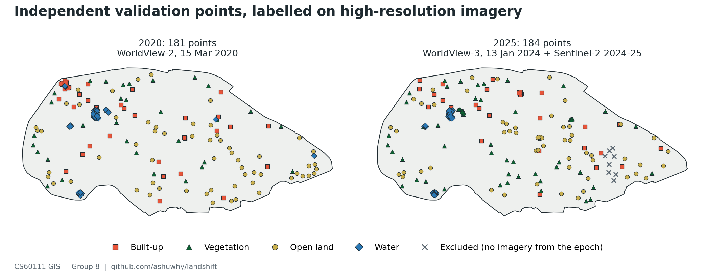

# Independent validation points: labelling notes

Reference points for the independent accuracy check in `gee/lulc_pipeline.js`.

- `gee/validation_points.js`: the eight point layers the pipeline looks for (`built20` ... `water25`).
- `validation/points.csv`: every point with its label, confidence, the map class it was drawn from, and a note.



## Points per class

| Year | Built-up | Vegetation | Open land | Water | Total |
|---|---|---|---|---|---|
| 2020 | 44 | 34 | 60 | 43 | 181 |
| 2025 | 31 | 58 | 59 | 36 | 184 |

Eight more 2025 points, all inside the south-east compound, are left out (hard case 1).
Confidence high / medium / low: 78 / 73 / 30 in 2020, 56 / 89 / 39 in 2025.

## Reference imagery

| Year | Image | Capture date | Gap to the epoch |
|---|---|---|---|
| 2020 | WorldView-2, 0.5 m | 15 Mar 2020 | 2 weeks after epoch 1 (1 Nov 2019 - 29 Feb 2020) |
| 2025 | WorldView-3, 0.31 m | 13 Jan 2024 | 10 months before epoch 2 (1 Nov 2024 - 28 Feb 2025) |

- Source is Esri World Imagery Wayback, not Google Earth Pro. Same kind of imagery (Maxar WorldView), and Wayback
  publishes the capture date and sensor of every release. The 15 Mar 2020 image is in the releases from
  14 Oct 2020 to 24 Feb 2022; the 13 Jan 2024 image is in every release since 27 Feb 2025 and in today's World
  Imagery. Each is a single scene over the whole campus (checked at five points).
- 13 Jan 2024 is the newest high-resolution image of the campus in Esri. Every 2025 point was also checked against
  the Sentinel-2 2024-25 composite for change after January 2024.
- Both images are offset from Sentinel-2. Matching image edges against the composites in `results/` gives 4.5 m east,
  0.8 m south for 2020 and 3.5 m west for 2024, the same in every quarter of the campus. Labels are corrected for it.

## How the points were drawn and labelled

- Stratified random sample on the map classes in `results/lulc_2020.png` and `results/lulc_2025.png`: 40 points
  each in built-up, vegetation and open land, at least 40 m apart and 20 m inside the fence. For water, every
  map-water location at least 12 m apart, since the map has only 0.9 ha of it: 61 points in 2020, 72 in 2025.
  `scripts/sample_validation_points.py`, seed 20201003.
- Labelled without seeing the map class. The label is the cover over most of the 10 m square around the point.
- Canopy over a roof or road is vegetation, since that is what the satellite sees. Synthetic track, paved courts,
  the helipad and solar panels are built-up. Lawns, sports fields, crop plots, dry grass, bare and cleared ground are
  open land. Scrub counts as vegetation once shrubs cover about half the square. Algae-covered ponds are water.

## Hard to label

1. **South-east compound, 2025** (87.318-87.322 E, 22.310-22.314 N). Scrub with tracks in January 2024, cleared or
   under construction in the Sentinel-2 2024-25 composite. Nothing from the epoch shows whether it is built-up or
   bare ground, so the 8 points there are marked `excluded` in `points.csv`. Worth a look in Google Earth Pro if it
   has 2025 imagery; set the label in the CSV and rerun `scripts/export_validation.py`.
2. **North sides of the new tall buildings, 2025** (around 87.3120 E 22.3135-22.3152 N, 87.3100 E 22.3201 N,
   87.3213 E 22.3166 N). Sentinel-2 sees deep shadow here and the map calls it water. The January 2024 image is
   off-nadir: roofs appear 15-20 m south of where the 2020 image has them, so the building edge is uncertain by
   about 10 m. Labelled as shaded lawn or roof from both images, low confidence. Not water either way.
3. **Green ponds.** The tank in the south-west (87.3002 E, 22.3086 N) and, in 2024, the large pond east of the
   swimming pool (87.3020 E, 22.3177 N) and the round pond south-west of it (87.2991 E, 22.3163 N) are covered in
   algae and look like lawns in true colour. The embankments and walkways around them give them away.
4. **Dark roofs, 2020.** In the north-west hostel complex (87.2985 E, 22.3210 N) the map paints water over dark roofs
   around a 15 m courtyard tank: 14 of the 16 map-water points there are roofs, the other two are the tank.
5. **East end, 2020.** Dry grass with scattered shrubs against scrub. Labelled open land unless shrubs covered about
   half the square.
6. **The pond west of the hostels** (87.3157 E, 22.3171 N). Open water in 2020, overgrown in January 2024 (vegetation);
   the 2025 map still calls it water.
7. **Mixed squares**: roof and lawn edges, tree-lined roads, pond banks. Labelled by majority, low confidence when it
   was close to half.

## What the points already show

This is a preview against the map classes read from `results/lulc_*.png`, the 3x3-filtered maps. The pipeline
classifies the unfiltered stack at each point, so the Code Editor matrices will differ a little.

| Map class | 2020: agree / points | 2025: agree / points |
|---|---|---|
| Built-up | 22 / 40 | 15 / 33 |
| Vegetation | 25 / 40 | 34 / 40 |
| Open land | 37 / 40 | 33 / 39 |
| Water | 42 / 61 | 36 / 72 |

- Built-up spreads onto lawns, courtyards, bare ground and trees next to buildings.
- Water picks up dark roofs (2020), building shadows (2025), the tree island in the large pond and the overgrown pond.
- In 2020, lawns and clearings among trees are often mapped as vegetation.
- Weighted by map-class area, overall accuracy comes to about 0.63 for 2020 and 0.76 for 2025.

Because the sample is stratified by map class, user's accuracy can be read straight off the confusion matrix.
Overall and producer's accuracy cannot: water is 0.2 % of the campus but a third of the points. Weight each
map-class column by its area share, OA = sum over classes of (area share x correct / column total)
(Olofsson et al. 2014).

## Running it in the Code Editor

1. code.earthengine.google.com, new script.
2. Paste `gee/validation_points.js`, then `gee/lulc_pipeline.js` below it. Save, Run.
3. The Console adds "hand-labelled points per class" and "[hand-labelled, independent]" blocks for 2020 and 2025.
   The per-class counts should match the table above.
4. Get Link for the shared script.

To redraw the sample or regenerate the layers and the figure:

```bash
python scripts/sample_validation_points.py .   # writes validation/candidates.csv (unlabelled)
python scripts/export_validation.py .          # points.csv -> gee/validation_points.js, docs/img/08_validation_points.png
```
